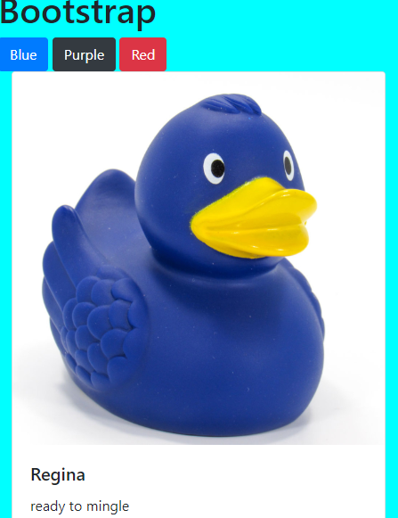

# bootstrap

## Descripition
This project explores the bootstrap grid system. We used bootstrap cards to display a collection of ducks (both real and rubber).  We also give our users the ability to sort by color, gender, and if they ducks are rubber.

## Screenshots

## How to run
1. Clone down this repo
1. Make sure you have http-server installed via npm. If not get it  [HERE](https://www.npmjs.com/package/http-server).
1. In your command line run `hs -p 9999`
1. In your browser go to to `http://localhost:9999`
